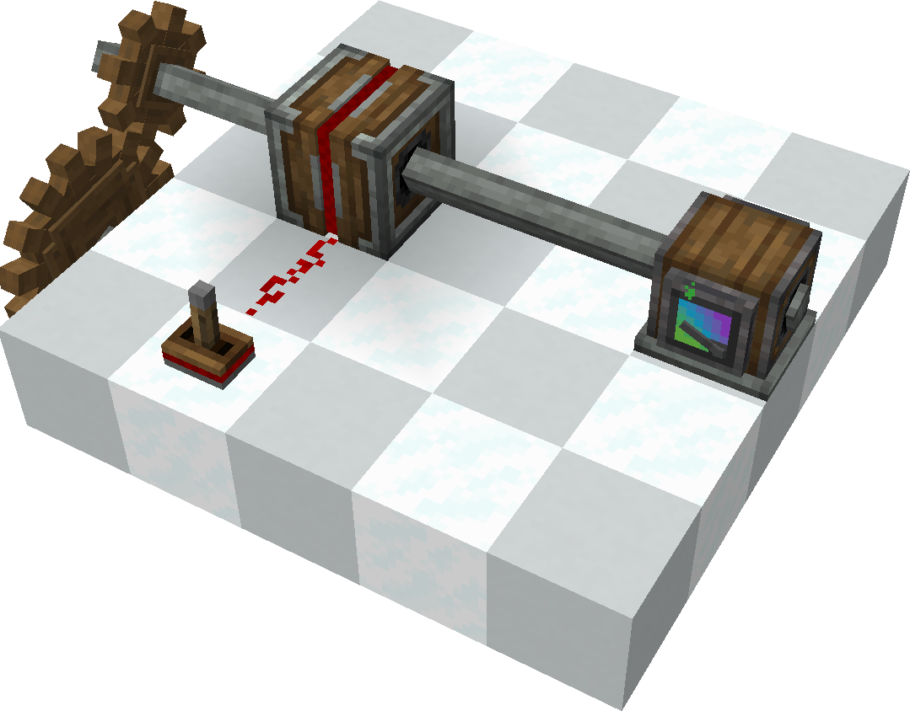

# Creatework

While the name might sound quite ambitious, **Creatework** is simply a mod that ports the **Redstone Resistor** from the [Clockwork](https://github.com/ValkyrienSkies/Clockwork) mod.

### Why I made this
While playing [Create Aeronautics](https://github.com/Creators-of-Aeronautics/Simulated-Project), I realized I really didn't want to go through the trouble of building a tedious and overly complex 8-speed transmission.\
So, I decided to port this specific feature to make things simpler!

### Image

### Credits
This mod is based on the source code of [Clockwork](https://github.com/ValkyrienSkies/Clockwork) and also utilizes some source code from the [Create](https://github.com/Creators-of-Create/Create) mod.